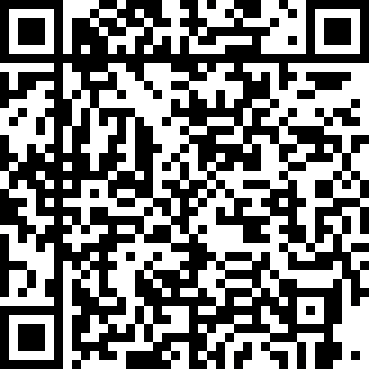

# monero-binary-verifier
A basic shell script that automates and simplifies the process of verifying the hashes of a monero CLI or GUI archive.

## Purpose
This script makes it possible for Monero users to forego the tedious process of manually verifying the authenticity of a Monero CLI or GUI wallet binary download in Linux or MacOS. If the Signing key, Hash File, or Monero binary archive SHA256 hash do not match their respective expected values, the script will notify the user and instruct them to re-download the non-matching file and try again.

## Instructions
  1. Download the script (verifyMoneroHashes.sh) and save it to the same file as the Monero binary archive to verify.
  2. Run the script, and provide the binary archive's file name as the first and only argument. For example:
  ```
  ./verifyMoneroHashes.sh monero-linux-x64-v0.17.1.1.tar.bz2
  ```

## Support the developer
If you benefit from this project and want to contribute to the developer, send Monero donations to:
<p align="center">
  <br>
  <code>49uJzuCp5rvCYGmiMHZF4FZcRELXZZW1PWzNwx23qpbQgiYRmgGKx2JeKzQCc12YgcSRvjvmcppm4UrftSaFYSnY4uigisj</code>
</p>


